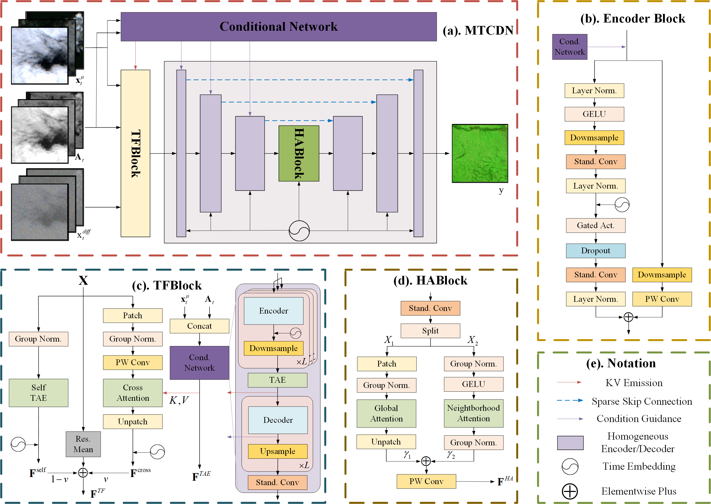

<h1 align="center">
SADER: Structure-Aware Diffusion Framework with Deterministic Resampling for Multi-Temporal Remote Sensing Cloud Removal
</h1>

<div align="center">
  Yifan Zhang<sup>1,*</sup>, Qian Chen<sup>2,*</sup>, Yi Liu<sup>2,*</sup>, Wengen Li<sup>2</sup>, Jihong Guan<sup>2</sup><br>
  <sup>1</sup>University of Michigan, Ann Arbor, USA &emsp; 
  <sup>2</sup>Tongji University, Shanghai, China<br>
  <sub>*Equal contribution</sub>
</div>

<br>

<div align="center">
  
</div>

<div align="center">
    <a href="https://github.com/zyfzs0/SADER"></a> &ensp;
    <a href="./README_zh.md"></a> &ensp;
    <a href="https://arxiv.org/abs/2602.00536"></a> &ensp;
     &ensp;
    <a href="https://github.com/zyfzs0/SADER/issues">  </a> &ensp;
    <a href="https://github.com/zyfzs0/SADER/pulls">  </a> &ensp;
</div>

<br>

This is the official repository for **SADER**, a structure-aware diffusion framework for multi-temporal remote sensing cloud removal that leverages a scalable multi-temporal conditional network, a cloud-aware attention loss, and a deterministic resampling strategy to achieve high-fidelity and reproducible cloud-free reconstruction.


## :chart_with_upwards_trend:Experimental Results

<table>
<tr>
<th align="center">1. Sen2_MTC_New</th>
<th align="center">2. SEN12MS-CR-TS(EA)</th>
</tr>
<tr>
<td valign="top">

| Method | PSNR ↑ | SSIM ↑ | LPIPS ↓ |
| :--- | :---: | :---: | :---: |
| McGAN (2017) | 17.448 | 0.513 | 0.447 |
| Pix2Pix (2017) | 16.985 | 0.455 | 0.535 |
| AE (2018) | 15.100 | 0.441 | 0.602 |
| CycleGAN (2017) | 17.678 | 0.615 | 0.392 |
| STGAN (2020) | 18.152 | 0.587 | 0.513 |
| CTGAN (2022) | 18.308 | 0.609 | 0.384 |
| FDH-CR (2026) | 19.477 | 0.682 | 0.299 |
| DAF-Net (2026) | 17.657 | 0.527 | 0.468 |
| CR-former (2024) | 16.434 | 0.541 | 0.468 |
| PMAA (2023) | 18.009 | 0.614 | 0.392 |
| CR-TS Net (2022) | 18.585 | 0.615 | 0.342 |
| UnCRtainTS (2023) | 18.770 | 0.631 | 0.333 |
| TMFNet (2026) | 18.019 | 0.624 | 0.411 |
| DDPM-CR (2023) | 18.742 | 0.614 | 0.329 |
| DiffCR (2024) | 19.150 | 0.531 | 0.255 |
| DE (2024) | 17.210 | 0.483 | 0.349 |
| SRP-CR (2025) | 19.666 | 0.677 | 0.251 |
| PCRDiff (2026) | 19.974 | <u>*0.708*</u> | 0.274 |
| EMRDM (2025) | <u>*20.249*</u> | 0.702 | <u>*0.244*</u> |
| **Ours (SADER)** | **20.941** | **0.729** | **0.228** |
| *Improvement* | *+3.42%* | *+2.97%* | *-6.56%* |

</td>
<td valign="top">

| Method | PSNR ↑ | SSIM ↑ | SAM (°) ↓ |
| :--- | :---: | :---: | :---: |
| McGAN (2017) | 25.279 | 0.819 | 10.051 |
| Pix2Pix (2017) | 23.303 | 0.818 | 10.932 |
| CycleGAN (2017) | 26.467 | 0.840 | 12.483 |
| STGAN (2020) | 25.534 | 0.731 | 12.992 |
| PMAA (2023) | 28.396 | 0.771 | 16.776 |
| DAF-Net (2026) | 27.111 | 0.617 | 6.247 |
| CR-former (2024) | 25.845 | 0.603 | 12.166 |
| CR-TS Net (2022) | 26.056 | 0.808 | 11.570 |
| U-TAE (2021) | 26.149 | 0.849 | 10.292 |
| TMFNet (2026) | 23.238 | 0.598 | 7.219 |
| UnCRtainTS (2023) | 28.756 | 0.914 | 8.428 |
| DiffCR (2024) | 26.072 | 0.522 | 11.662 |
| DE (2024) | 26.337 | 0.570 | 10.412 |
| SeqDMs (2023) | 28.074 | 0.827 | 12.777 |
| PCRDiff (2026) | 27.589 | 0.834 | 7.623 |
| EMRDM (2025) | <u>*29.320*</u> | <u>*0.926*</u> | <u>*5.933*</u> |
| **Ours (SADER)** | **31.234** | **0.937** | **5.885** |
| *Improvement* | *+6.53%* | *+1.19%* | *-0.81%* |

</td>
</tr>
</table>

## :tada:Usage
### :wrench:Setup

There are two methods to set up the development environment for this project. The first method uses `requirements.txt` for a straightforward installation into your current Python environment. The second method employs an `environment.yaml` file to create a new, isolated conda environment named `sader`. Choose the method that best suits your workflow.

**Method 1: Using `requirements.txt` (pip)**
Install the required Python packages directly into your current environment using pip.
```bash
pip install -r requirements.txt
```

**Method 2: Using `environment.yaml` (conda)**
Create a new, isolated conda environment named `sader` with all dependencies specified in the `environment.yaml` file.
```bash
conda env create -f environment.yaml
```
To activate this environment after creation, use the following command:
```bash
conda activate sader
```

(*Optional*) If you still encounter the package missing problem, you can refer to the [`requirements.txt`](./requirements.txt) file to download the packages you need. 

**If you meet other enviroment setting problems we have not mentioned in this readme file, please contack us to report you problems or throw a issue.**


### :pushpin:Dataset
We use two datasets: SEN12MS-CR-TS(EA) and Sen2\_MTC\_New. You need to download these datasets first. 

We provide the downloading URLs of these datasets as follows:

|Dataset|Type| URL |
|-------|----|-----|
|SEN12MS-CR-TS(EA)| Multi-Temporal| [https://patricktum.github.io/cloud_removal/sen12mscrts/](https://patricktum.github.io/cloud_removal/sen12mscrts/)|
|Sen2\_MTC\_New| Multi-Temporal|[https://github.com/come880412/CTGAN](https://github.com/come880412/CTGAN)|

> **Note on SEN12MS-CR-TS (Eastern Asia / EA)**: For evaluation on the Eastern Asia subset of SEN12MS-CR-TS, the test set specifically evaluates on the representative region `ROIs1868/73` (comprising 240 multi-temporal sequence samples).

For fast starting, you can only download the testing dataset and run the testing instructions given below.

### :mag_right:Configurations
We provide our configuration files, *i.e.*, `*.yaml`, in the `./configs/example_training/` folder. The code automatically reads the `yaml` file and sets the configuration. You can change the settings, such as the data path, batch size, number of workers, in the `data` part of each `yaml` file to adapt to your expectations. Read the `yaml` file in `./configs/example_training/` for more details. 

We have also included the `yaml` files for our ablation experiments in the `./configs/example_training/ablation/` directory. 
### :fire:Train
You can use the following instruction in the root path of this repository to run the training process:
```bash
python main.py --base configs/example_training/[yaml_file_name].yaml --enable_tf32
```
Here, [`sen2_mtc_new.yaml`](./configs/example_training/sen2_mtc_new.yaml) is for training on the Sen2\_MTC\_New dataset, and [`sentinel.yaml`](./configs/example_training/sentinel.yaml) is for training on the SEN12MS-CR dataset. Note that you should modify the `data.params.train` part in the `yaml` file according to your dataset path.

You can also use the `-l` parameter to change the save path of logs, with `./logs` as the default path:

```bash
python main.py --base configs/example_training/[yaml_file_name].yaml --enable_tf32 -l [path_to_your_logs]
```
If you want to resume from a previous training checkpoint, you can use the follow instruction:
```bash
python main.py --base configs/example_training/[yaml_file_name].yaml --enable_tf32 -r [path_to_your_ckpt]
```
If you want to initiate the model from an existing checkpoint and restart the training process, you should modify the value of `model.ckpt_path` in your `yaml` file to the path of your checkpoint.
### :runner:Test
Run the following instruction for testing:
```bash
python main.py --base configs/example_training/[yaml_file_name].yaml --enable_tf32 -t false
```
The `[yaml_file_name].yaml` files are the same as those in training process. Note that
- You should set the `data.params.test` part, otherwise the test dataloader will not be implemented.
- You should modify he value of `model.ckpt_path` in your `yaml` file to the path of your checkpoint.
### :computer:Predict
The predicting process will output all cloud removed images. This process only support using one GPU (by setting `lightning.trainer.devices` to only one device). You can run predicting process using:
```bash
python main.py --base configs/example_training/[yaml_file_name].yaml --enable_tf32 -t false --no-test true --predict true
```
The `[yaml_file_name].yaml` files are the same as those in the testing process. Note that you should set the `data.params.predict` part and the `model.ckpt_path` part (the same way as testing), otherwise you will not obtain the correct results.


## :email:Contact
If you have encountered any problems, feel free to contact author via the email <a href="mailto:yifanzhg@umich.edu">yifanzhg@umich.edu</a> or <a href="mailto:2250951@tongji.edu.cn">2250951@tongji.edu.cn</a>. 

## :book:BibTeX
```bibtex
@article{zhang2026sader,
  title={SADER: Structure-Aware Diffusion Framework with DEterministic Resampling for Multi-Temporal Remote Sensing Cloud Removal},
  author={Zhang, Yifan and Chen, Qian and Liu, Yi and Li, Wengen and Guan, Jihong},
  journal={arXiv preprint arXiv:2602.00536},
  year={2026}
}
```
